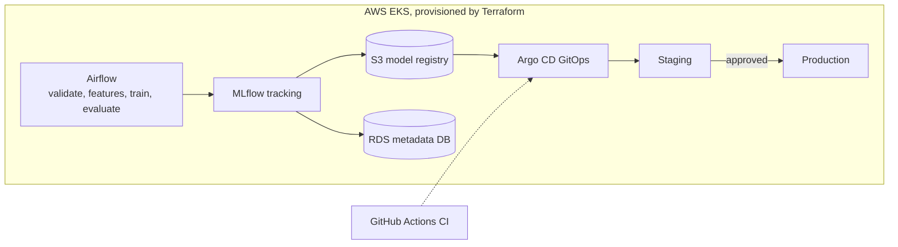
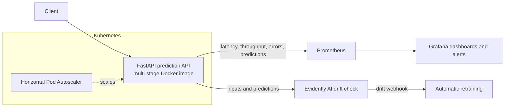
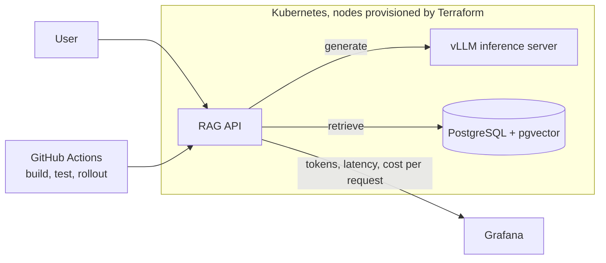

<!--
  Profile README for github.com/Faiz-Hussain650
  Before publishing: replace every REPO_* link and CREDLY_* link with real URLs.
-->

<a id="top"></a>

<div align="center">

<h1>Hi, I'm Faiz Hussain 👋</h1>

<a href="https://git.io/typing-svg">
  
</a>

<p>
  
  
  
</p>

<p>
  <a href="#about">About</a> •
  <a href="#tech-stack">Tech Stack</a> •
  <a href="#experience">Experience</a> •
  <a href="#projects">Projects</a> •
  <a href="#certifications">Certifications</a> •
  <a href="#education">Education</a> •
  <a href="#github-activity">GitHub Activity</a> •
  <a href="#connect">Connect</a>
</p>

</div>

<hr />

## About

- ⚙️ **MLOps and DevOps Engineer** with 2+ years automating AWS infrastructure and CI/CD delivery
- 💼 Former **DevOps Engineer (Senior Associate)** at **NTT DATA**, Bangalore
- 🚀 Focused on running ML in production: training pipelines, model registries, GitOps promotion, serving and drift monitoring
- 🎓 Completing an **MSc in Data Science** at the University of Naples Federico II (Sept 2026)
- ☁️ **3x AWS Certified**, including DevOps Engineer Professional
- 🗣️ English C1 | Italian A2 (improving)

<details>
<summary><b>▶ whoami.yaml</b> (click to expand)</summary>

```yaml
name: Faiz Hussain
role: [MLOps Engineer, DevOps Engineer]
location: Milan, Italy
experience:
  - company: NTT DATA
    title: DevOps Engineer (Senior Associate, IT)
    period: 2021-09 to 2023-08
education: MSc Data Science, University of Naples Federico II (2026)
cloud: AWS
daily_tools: [Terraform, Kubernetes, Docker, Helm, GitHub Actions, MLflow, Prometheus]
languages: {english: C1, italian: A2}
looking_for: MLOps / DevOps / Platform roles in the EU
```

</details>

<hr />

## Tech Stack

| Area | Tools |
|---|---|
| **Cloud** |        |
| **MLOps** |       |
| **IaC** |    |
| **Containers** |    |
| **CI/CD** |     |
| **Monitoring** |    |
| **Code, ML and Data** |        |

<hr />

## Experience

<details open>
<summary><b>💼 DevOps Engineer (Senior Associate, Information Technology) | NTT DATA</b> | Bangalore, India | Sep 2021 to Aug 2023</summary>

<br />

- Built and managed AWS infrastructure (EC2, ECS, VPC, S3) for production workloads
- Automated infrastructure provisioning with **Terraform**, increasing deployment speed by **45%**
- Developed CI/CD pipelines in **Jenkins** and **AWS CodePipeline**, cutting release time from hours to minutes
- Deployed and maintained containerised microservices on **Kubernetes (EKS)** with Docker and Helm
- Configured **CloudWatch** monitoring, logging and alerting to improve system reliability
- Reduced AWS infrastructure costs by **20%** through right-sizing and resource optimisation
- Designed high-availability architecture with load balancing and auto-scaling
- Worked in Agile sprints with developers and QA to ship releases on schedule

</details>

<hr />

## Projects

> Click a project to expand the stack, architecture diagram and results.

<details>
<summary><b>1️⃣ End-to-End MLOps Platform on AWS</b> | reproducible training-to-deployment with one-command rollback</summary>

<br />


**What I built**
- Provisioned the full platform with Terraform: EKS cluster, S3 artifact store, RDS metadata database, IAM roles
- Automated the training pipeline in Airflow: data validation, feature generation, training, evaluation
- Tracked experiments and versioned models in MLflow with an S3-backed model registry
- Promoted approved models to staging and production automatically with Argo CD (GitOps)

**Architecture**



**Result:** fully reproducible training-to-deployment workflow, one-command rollback, no manual steps.

🔗 [Repository](https://github.com/Faiz-Hussain650/REPO_MLOPS_PLATFORM) | 📐 [ARCHITECTURE.md](https://github.com/Faiz-Hussain650/REPO_MLOPS_PLATFORM/blob/main/ARCHITECTURE.md)

</details>

<details>
<summary><b>2️⃣ Real-Time Model Serving API with Drift Monitoring</b> | sub-100ms p95 latency, automated drift alerting</summary>

<br />


**What I built**
- Prediction API in FastAPI, packaged as a lightweight multi-stage Docker image
- Deployed on Kubernetes with Horizontal Pod Autoscaling for variable traffic
- Prometheus metrics for latency, throughput, error rate and prediction distribution
- Data drift detection with Evidently AI, triggering automatic retraining via webhook

**Architecture**



**Result:** sub-100ms p95 latency, Grafana dashboards, automated drift alerting.

🔗 [Repository](https://github.com/Faiz-Hussain650/REPO_MODEL_SERVING) | 📐 [ARCHITECTURE.md](https://github.com/Faiz-Hussain650/REPO_MODEL_SERVING/blob/main/ARCHITECTURE.md)

</details>

<details>
<summary><b>3️⃣ Containerised LLM Application on Kubernetes</b> | reproducible LLM serving with autoscaling and cost visibility</summary>

<br />


**What I built**
- Open-source LLM inference server (vLLM) on Terraform-provisioned Kubernetes nodes
- Retrieval-augmented generation API backed by a pgvector document database
- Automated build, test and rollout of every component through GitHub Actions
- Token usage, latency and cost per request tracked in Grafana for capacity planning

**Architecture**



**Result:** reproducible LLM serving stack with autoscaling and clear cost visibility.

🔗 [Repository](https://github.com/Faiz-Hussain650/REPO_LLM_K8S) | 📐 [ARCHITECTURE.md](https://github.com/Faiz-Hussain650/REPO_LLM_K8S/blob/main/ARCHITECTURE.md)

</details>

<hr />

## Certifications

<p>
  <a href="CREDLY_DEVOPS_PRO"></a>
  <a href="CREDLY_SAA"></a>
  <a href="CREDLY_CCP"></a>
</p>

<sub>Click a badge to verify on Credly.</sub>

<hr />

## Education

<details open>
<summary><b>🎓 Academic background</b></summary>

<br />

| Degree | Institution | Period |
|---|---|---|
| **MSc in Data Science** | University of Naples Federico II, Italy | 2023 to Sept 2026 |
| **BTech in Engineering** | Dayananda Sagar University, India | 2017 to 2021 |

Relevant coursework: Machine Learning, Statistical Modelling, Big Data (Spark), Databases, Cloud Computing.

</details>

<hr />

## GitHub Activity

<div align="center">


<table align="center" border="0" cellpadding="10" cellspacing="0">
  <tr>
    <td valign="top">
      
    </td>
    <td valign="top">
      
    </td>
  </tr>
</table>


<picture>
  <source media="(prefers-color-scheme: dark)" srcset="https://raw.githubusercontent.com/Faiz-Hussain650/Faiz-Hussain650/output/github-snake-dark.svg" />
  <source media="(prefers-color-scheme: light)" srcset="https://raw.githubusercontent.com/Faiz-Hussain650/Faiz-Hussain650/output/github-snake.svg" />
  
</picture>

</div>

<hr />

## Connect

<div align="center">

<a href="https://linkedin.com/in/faiz-hussain" target="_blank">
  
</a>
&nbsp;
<a href="mailto:faizarfahussain@gmail.com">
  
</a>
&nbsp;
<a href="https://github.com/Faiz-Hussain650" target="_blank">
  
</a>

<br /><br />


<p><a href="#top">⬆ Back to top</a></p>

</div>
